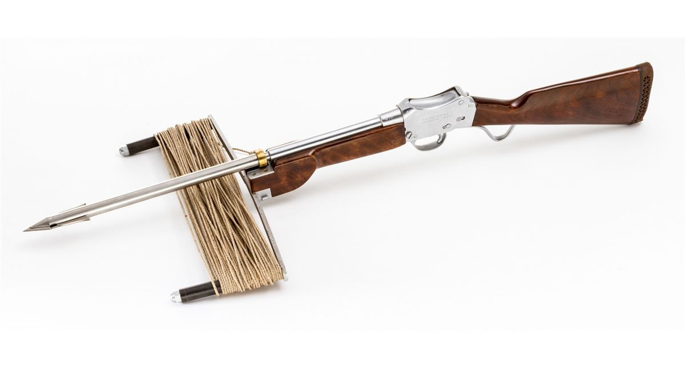

# a very large heading

## a large heading

### a heading

#### no

*surround text with asterisks*

**bold**

***HOLY SHIT***

~~strike through / strike out~~

put the styles

inline *stylized* text
    here **we** go


* item 1
  * sub item
* item 2
* item 3


1. order 1
  1. sub item
2. order 2
3. order 3

```
var testArr = [];
testArr.push({});
```

[i am a link!](http://www.reddit.com)


<!-- the text in the brackets above appears when the image link doesn't work -->


